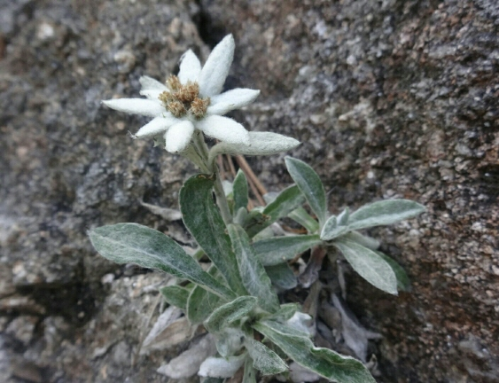

<h2 align="center">Hello! I'm Korea Mountain Girl 👧</h2>
 

  

 
 &nbsp;
 &nbsp;
 
 

  <h4 align="center">Korea Mountain Girl and Application Software Developer especially likes Mt.Seorak Mt.Bukhan and Mt.Jiri.</h4>
  <h4 align="center">자연을 아끼며 산악문학에 관심이 많은 산악 애호가인 동시에 윈도우 응용프로그램 생계형 개발자입니다. </h4>

  -------

## 전자지도

- [**모바일용 온맵 다운로드**](https://github.com/sansonyeo/oruxmaps)
  
  -------
  
## Working Project (WebService)

- [**닷넷 웹서비스 구현중 sansonyeo:86**](http://112.151.93.8:86/WebService1.asmx?op=SelectCertificates)
- [**닷넷 웹서비스 구현중 localhost:86**](http://192.168.219.105:86/WebService1.asmx?op=SelectCertificates)

<!-- 
  
  
  
  
  
  
https://emojipedia.org/snow-capped-mountain/ 
  -------

### Hi there 👋 :ski:
**sangirl/sangirl** is a ✨ _special_ ✨ repository because its `README.md` (this file) appears on your GitHub profile.
-->
